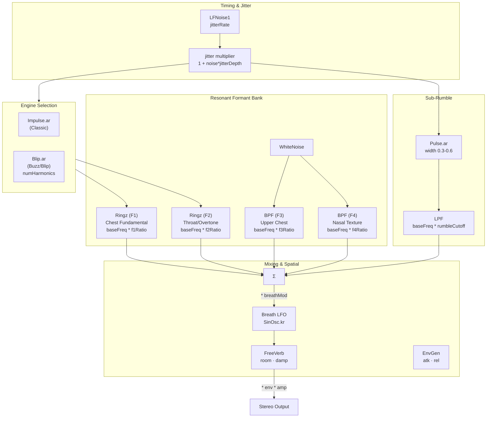

# purr

A cat purr synthesizer running headlessly on a [Bela Gem](https://bela.io/products/bela-mini/) (PocketBeagle 2) or any SuperCollider instance, controllable over WiFi via a browser UI.

Designed as a data sonifier: three normalized input dimensions — pitch, intensity, arousal — map onto the synthesis engine in a perceptually coherent way. The SynthDef is intentionally parameter-rich so the mapping can be adjusted without touching the audio code.

---

## Architecture

```
index.html  ->  osc-bridge.js  ->  UDP OSC  ->  SuperCollider (127.0.0.1:57120)
 browser        localhost:3131              catpurr.scd (or catpurr_bela.scd)
```

- **`catpurr.scd`** — Dual-engine SuperCollider SynthDefs + OSC handlers.
- **`osc-bridge.js`** — Node.js server that accepts HTTP POST from the browser and forwards as UDP OSC.
- **`index.html`** — Browser controller: a high-level Sonification panel and a full low-level panel.

---

## Synthesis design

### Dual Engine: Classic vs. Buzz

The system now supports two distinct synthesis engines selectable from the UI:

1.  **Classic (Impulse)**: Uses a standard `Impulse` train. This creates a traditional, "clicky" glottal pulse that is then smoothed by resonators.
2.  **Buzz (Blip)**: Uses a band-limited `Blip` pulse train. This provides a much richer, "vocal" quality. You can control the harmonic content via the `numHarmonics` parameter, allowing for a spectrum of sounds from a smooth hum to a buzzy "vocal" purr.

---

### Overview

The synth is a **formant bank** built around a single `baseFreq` anchor. Every resonant frequency in the bank is expressed as `baseFreq * ratio`, ensuring the entire spectral character shifts coherently when pitch changes.

There are two parallel signal paths:

- **Transient path** — a jittered impulse or blip train drives two `Ringz` resonators (F1, F2). This produces the characteristic *thump-thump-thump* rhythm.
- **Sustained path** — a `WhiteNoise` source feeds two narrow BPF resonators (F3, F4). This provides the continuous breath texture.

Both paths are multiplied by a slow breath LFO and mixed into a `FreeVerb` reverb.

---

### Synth Signal Flow



---

## Sonification mapping layer

The three high-level controls each drive a bundle of low-level synth parameters. All mappings are linear over the normalized 0–1 input range. 

### pitch (0–1)

Pitch shifts the spectral centre of the entire instrument.

| Synth parameter | Formula | Range |
|---|---|---|
| `baseFreq` | `20 * (40 ** p)` | 20–800 Hz (exponential) |
| `purrRate` | `15 + p * 65` | 15–80 Hz |

### intensity (0–1)

Intensity controls energy level and presence.

| Synth parameter | Formula | Range |
|---|---|---|
| `amp` | `0.15 + i * 0.55` | 0.15–0.70 |
| `f1Amp` | `0.30 + i * 0.35` | 0.30–0.65 |
| `f2Amp` | `0.20 + i * 0.25` | 0.20–0.45 |
| `rumbleAmp` | `0.08 + i * 0.30` | 0.08–0.38 |

### arousal (0–1)

Arousal controls temporal character and "presence".

| Synth parameter | Formula | Range | Direction |
|---|---|---|---|
| `jitterDepth` | `0.02 + a * 0.20` | 0.02–0.22 | up: more irregular |
| `breathRate` | `0.15 + a * 1.20` | 0.15–1.35 Hz | up: faster breath |
| `reverbMix` | `0.55 - a * 0.40` | 0.55 to 0.15 | down: drier |
| `f1Decay` | `0.08 - a * 0.05` | 80 to 30 ms | down: punchier |

---

## OSC protocol

### Control Messages

| Address | Args | Description |
|---|---|---|
| `/purr/pitch` | `f: 0-1` | High-level pitch mapping |
| `/purr/intensity` | `f: 0-1` | High-level intensity mapping |
| `/purr/arousal` | `f: 0-1` | High-level arousal mapping |
| `/purr/gate` | `i: 1|0`, `i: 0|1` | **Start/Stop.** Second arg: `0` for Classic, `1` for Buzz. |
| `/purr/set` | `s:key f:val` | Direct parameter access (e.g., `numHarmonics`) |

---

## Running it

1.  **Install dependencies**: `npm install`
2.  **Start Bridge**: `node osc-bridge.js`
3.  **Run SuperCollider**: Open `catpurr.scd` in SuperCollider IDE and run it.
4.  **Open Controller**: Open `index.html` in your browser.
