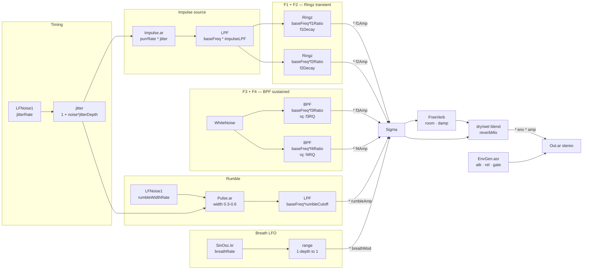
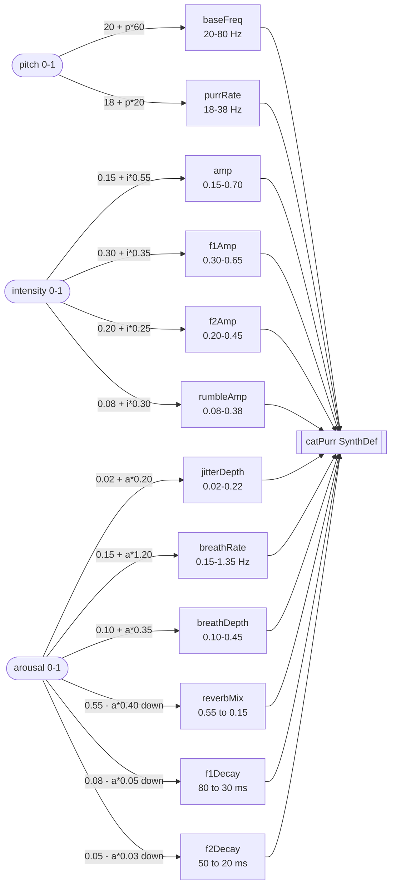

# purr

A cat purr synthesizer running headlessly on a [Bela Gem](https://bela.io/products/bela-mini/) (PocketBeagle 2), controllable over WiFi via a browser UI.

Designed as a data sonifier: three normalized input dimensions — pitch, intensity, arousal — map onto the synthesis engine in a perceptually coherent way. The SynthDef is intentionally parameter-rich so the mapping can be adjusted without touching the audio code.

---

## Architecture

```
index.html  ->  osc-bridge.js  ->  UDP OSC  ->  Bela (192.168.1.43:57120)
 browser        localhost:3131              catpurr_bela.scd
```

- **`catpurr_bela.scd`** — SuperCollider SynthDef + OSC handlers, running on the Bela.
- **`osc-bridge.js`** — Node.js server that accepts HTTP POST from the browser and forwards as UDP OSC.
- **`index.html`** — Browser controller: a high-level Sonification panel (pitch / intensity / arousal) and a full low-level panel exposing every SynthDef parameter.

---

## Synthesis design

### Overview

The synth is a **formant bank** built around a single `baseFreq` anchor. Every resonant frequency in the bank is expressed as `baseFreq * ratio`, which means the entire spectral character shifts coherently when pitch changes — the same way a cat's purr maintains its timbre across individuals of different sizes.

There are two parallel signal paths:

- **Transient path** — a jittered impulse train drives two `Ringz` resonators (F1, F2). This produces the characteristic *thump-thump-thump* rhythm of a purr.
- **Sustained path** — the same `WhiteNoise` source feeds two narrow BPF resonators (F3, F4). This provides the continuous breath texture between pulses.

Both paths are multiplied by a slow breath LFO and mixed into a `FreeVerb` reverb, whose main job is to smooth individual glottal pulses into a seamless rumble. An ASR envelope gates the whole synth.

---

### Timing and jitter

```
LFNoise1(jitterRate) -> * jitterDepth -> + 1.0 = jitter multiplier
                                                        |
purrRate --------------------------------------------> * = rate
```

`jitter` is a slow random modulation centred on 1.0. Multiplying `purrRate` by it produces a pulse rate that wanders slightly — the biological variation in a real cat's glottal cycle. `jitterRate` controls how fast the wander moves (typically 4 Hz). `jitterDepth` scales the excursion: at 0 the rate is perfectly steady; at 0.4 it wanders ±40%.

---

### Impulse source (shared by F1 and F2)

```
Impulse.ar(rate) -> LPF(baseFreq * impulseLPF) -> impulses
```

A raw `Impulse` is a single-sample click — too sharp for a natural sound. Passing it through a low-pass filter with cutoff proportional to `baseFreq` rounds it into a brief transient. The `impulseLPF` ratio (default 2.0) means at `baseFreq = 40 Hz` the impulse LPF is 80 Hz. Higher values pass more of the click; lower values make a softer thud.

---

### F1 — chest fundamental (Ringz)

```
impulses -> Ringz(freq: baseFreq * f1Ratio, decaytime: f1Decay) * f1Amp
```

`Ringz` is a resonant filter that rings at a fixed frequency for a fixed decay time on each impulse. F1 rings at `baseFreq * 1.0` — the fundamental — modelling the low chest resonance of the thoracic cavity. At `f1Decay = 50 ms`, each glottal pulse produces a 50 ms ring. Longer decay blurs adjacent pulses together; shorter produces a sharper chest thump.

---

### F2 — throat / first overtone (Ringz)

```
impulses -> Ringz(freq: baseFreq * f2Ratio, decaytime: f2Decay) * f2Amp
```

F2 runs at `f2Ratio = 2.1*` — a slightly stretched octave rather than a clean 2x. The small stretch mimics the inharmonicity of real vocal tract resonances, which are never perfect integer multiples. Default decay is 30 ms, shorter than F1 so the overtone decays faster and the fundamental body of each pulse lingers longer.

---

### F3 — upper chest (BPF noise)

```
WhiteNoise -> BPF(freq: baseFreq * f3Ratio, rq: f3RQ) * f3Amp
```

Rather than impulse-driven resonators, F3 and F4 use a shared `WhiteNoise` source. A band-pass filter extracts a narrow band: at `f3Ratio = 4.5` and `baseFreq = 40 Hz`, the centre is 180 Hz. The `rq` parameter is the *reciprocal* of Q — lower rq means narrower bandwidth and a more tonal quality; higher rq means a wider, noisier band.

This layer provides the continuous hiss component of a purr — breath texture present throughout the cycle, not just at each pulse.

---

### F4 — nasal texture (BPF noise)

```
WhiteNoise -> BPF(freq: baseFreq * f4Ratio, rq: f4RQ) * f4Amp
```

Identical architecture to F3 but an octave higher (`f4Ratio = 9.0` = 360 Hz at default baseFreq). This adds a subtle nasal brightness. It is intentionally very quiet (`f4Amp = 0.03`) — mostly felt rather than heard.

---

### Rumble

```
LFNoise1(rumbleWidthRate) -> range(0.3, 0.6) = width
                                                    |
rate ------------------------------------------------> Pulse.ar(rate, width)
                                                              |
                                               LPF(baseFreq * rumbleCutoff) * rumbleAmp
```

A `Pulse` oscillator at the same `rate` as the impulse train, with a slowly varying duty cycle (30–60%), provides a low-frequency body. Passing it through an LPF whose cutoff tracks `baseFreq` keeps it subsonically warm. This layer is primarily felt as low-end mass.

---

### Breath modulation

```
SinOsc.kr(breathRate) -> range(1 - breathDepth, 1.0) = breathMod
```

A slow sinusoidal LFO multiplies the entire mixed signal, simulating inhalation/exhalation cycles. `breathRate = 0.35 Hz` is roughly one breath every 3 seconds. `breathDepth = 0.3` means the signal dips to 70% amplitude at the quietest point.

---

### Mix, reverb, and output

```
(F1 + F2 + F3 + F4 + rumble) * breathMod = sig

FreeVerb(sig, mix:1, room:reverbRoom, damp:reverbDamp) = wet
output = sig*(1 - reverbMix) + wet*reverbMix

output * EnvGen.asr(atk, 1, rel) * amp -> Out.ar (stereo)
```

`FreeVerb` is run in full-wet mode and blended with the dry signal. Its primary function is to blur the rhythmic impulse train into a continuous drone — the reverb tail of each Ringz ring overlaps with the next pulse, creating the sustained quality of a real purr even at low rates. `reverbDamp` controls how quickly high-frequency content decays in the tail.

The final ASR envelope gates the whole synth smoothly.

---

### Synth signal flow



---

## Sonification mapping layer

The three high-level controls each drive a bundle of low-level synth parameters. All mappings are linear over the normalized 0–1 input range. Parameters marked ↓ are inverse — the synth parameter *decreases* as the control increases.

### pitch (0–1)

Pitch shifts the spectral centre of the entire instrument.

| Synth parameter | Formula | Range |
|---|---|---|
| `baseFreq` | `20 * (40 ** p)` | 20–800 Hz (exponential) |
| `purrRate` | `15 + p * 65` | 15–80 Hz |

`baseFreq` is the anchor that all formant frequencies multiply from. Because F1–F4 are all `baseFreq * ratio`, moving it shifts the complete harmonic structure without changing its internal shape. `purrRate` moves with pitch because larger, heavier animals purr more slowly; scaling them together keeps the result biologically coherent.

---

### intensity (0–1)

Intensity controls energy level without changing character.

| Synth parameter | Formula | Range |
|---|---|---|
| `amp` | `0.15 + i * 0.55` | 0.15–0.70 |
| `f1Amp` | `0.30 + i * 0.35` | 0.30–0.65 |
| `f2Amp` | `0.20 + i * 0.25` | 0.20–0.45 |
| `rumbleAmp` | `0.08 + i * 0.30` | 0.08–0.38 |

Rather than a single volume control, intensity scales `amp` (master level), both Ringz amplitudes, and the rumble together. This keeps the internal balance of the formant bank stable while overall loudness and presence track the data.

---

### arousal (0–1)

Arousal controls temporal character: the difference between a sleeping cat purring and one being held.

| Synth parameter | Formula | Range | Direction |
|---|---|---|---|
| `jitterDepth` | `0.02 + a * 0.20` | 0.02–0.22 | up: more irregular |
| `breathRate` | `0.15 + a * 1.20` | 0.15–1.35 Hz | up: faster breath |
| `breathDepth` | `0.10 + a * 0.35` | 0.10–0.45 | up: deeper modulation |
| `reverbMix` | `0.55 - a * 0.40` | 0.55 to 0.15 | down: drier, more immediate |
| `f1Decay` | `0.08 - a * 0.05` | 80 to 30 ms | down: punchier pulses |
| `f2Decay` | `0.05 - a * 0.03` | 50 to 20 ms | down: punchier pulses |

**Low arousal (0):** long reverb tail blurs pulses into a smooth drone; slow, shallow breath; barely any jitter; long Ringz decays overlap. Sounds distant and content.

**High arousal (1):** dry and immediate; fast breath; pronounced jitter; short Ringz decays that don't overlap, making each glottal pulse distinct. Sounds present, attentive, or excited.

The inverse relationships on `reverbMix` and decay times are deliberate — they prevent combinations that are simultaneously dry *and* blurry, or wet *and* punchy. The mapping is physically coherent.

---

### Sonification mapping diagram



---

## Running it

**1. Start the OSC bridge** (on your laptop):

```bash
npm install
node osc-bridge.js
```

**2. Deploy and run on the Bela:**

```bash
scp catpurr_bela.scd root@192.168.1.43:/root/Bela/projects/catpurr/_main.scd
ssh root@192.168.1.43 "screen -dmS purr bash -c 'cd /root/Bela && make run PROJECT=catpurr'"
```

**3. Open the controller:**

Open `index.html` in a browser. Use **⇅ sync** after connecting to push all current slider values to the synth.

---

## OSC protocol

All messages to `192.168.1.43:57120`.

### High-level (sonification mapping)

| Address | Args | Description |
|---|---|---|
| `/purr/pitch` | `f: 0-1` | Shifts baseFreq (20-80 Hz) + purrRate (18-38 Hz) |
| `/purr/intensity` | `f: 0-1` | Scales amp, formant levels, rumble |
| `/purr/arousal` | `f: 0-1` | Controls temporal character (jitter, breath, reverb, decays) |

### Low-level (direct parameter access)

| Address | Args | Description |
|---|---|---|
| `/purr/set` | `s:paramName  f:value` | Set any SynthDef parameter by name |
| `/purr/gate` | `i: 1|0` | Start (1) or stop (0) the synth |
